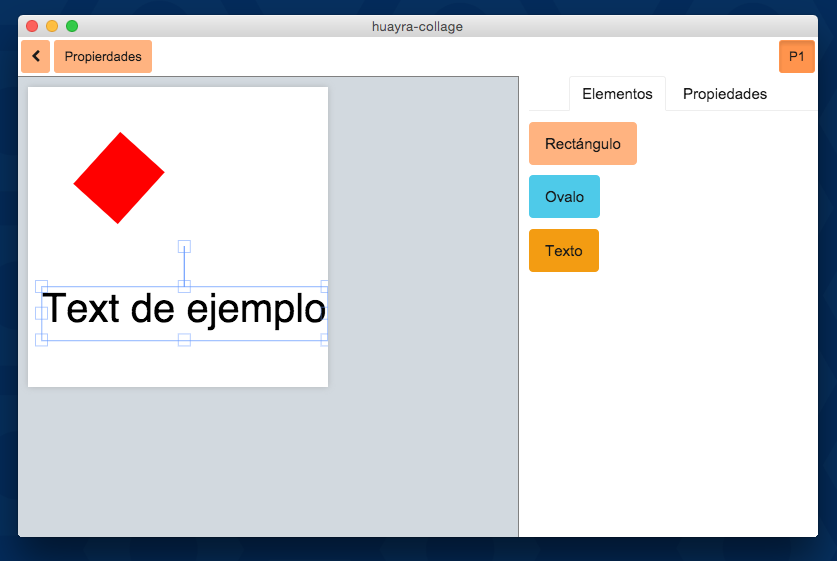

¡Hola, esto es huayra-collage!
==========================

huayra-collage es una aplicación de diseño vectorial
sencilla, desarrollada con fabricjs, ember y nwjs.

¿Cómo instalar?
---------------

En estas primeras versiones, solo se puede usar la aplicación desde los repositorios siguiendo
estos pasos:

- Clonar el repositorio
- ejecutar: ``make iniciar``
- ejecutar: ``make compilar``
- ejecutar: ``make ejecutar_linux``
